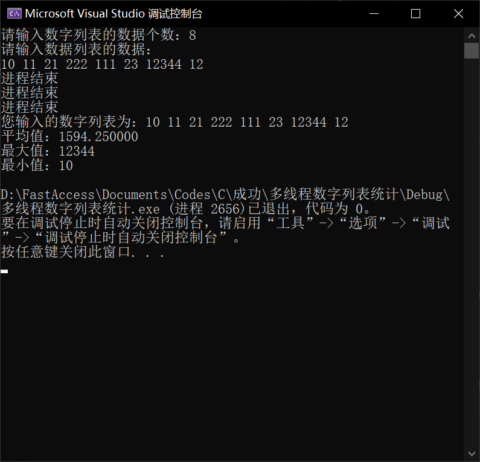

[TOC]

# 多线程程序

## 题目内容

1. Write a multithreaded program that calculates various statistical values for a list of numbers. This program will be passed a series of numbers on the command line and will then create three separate worker threads. One thread will determine the average of the numbers, the second will determine the maximum value, and the third will determine the minimum value. For example, suppose your program is passed the integers 
   ```
   90 81 78 95 79 72 85
   ```
   
   The program will report:
   
   ```
   The average value is 82
   The minimum value is 72
   The maximum value is 95
   ```
2. The variables representing the average, minimum, and maximum values will be stored globally. The worker threads will set these values, and the parent thread will output the values once the workers have exited.

## 源码

```c
#define _CRT_SECURE_NO_WARNINGS

#include<stdio.h>
#include<windows.h>

//传参结构
typedef struct PARAMETER
{
	int* List;
	int num;
	int (*Func)(int* List, int num);		//线程函数中执行的函数
}PARAMETER;

//全局变量作为统计值
int g_max = 0, g_min = 0;
float g_average = 0;

//用户输入数字列表，第一行为列表中整形数字个数，第二行为列表中整形数据，空格分隔
int InputNumberList(int** List, int* num)
{
	int ret = 0;
	int i = 0;

	//参数检查
	if (List == NULL || num == NULL)
	{
		ret = -1;
		printf("func InputNumberList() err: ret = %d(List == NULL || num == NULL)\n", ret);
		return ret;
	}

	printf("请输入数字列表的数据个数：");
	scanf("%d", num);

	//向栈区申请空间存储数据列表中的数据
	*List = (int*)malloc(sizeof(int) * (*num));
	if (*List == NULL)
	{
		ret = -2;
		printf("func InputNumberList() err: ret = %d(*List == NULL)\n", ret);
		return ret;
	}

	//让用户输入数据列表的数据
	printf("请输入数据列表的数据：\n");
	for (i = 0; i < *num; i++)
	{
		scanf("%d", &((*List)[i]));
	}

	return ret;
}

//打印数字列表和统计结果
void PrintNumList(int* List, int num)
{
	int i = 0;

	//打印数字列表
	printf("您输入的数字列表为：");
	for (i = 0; i < num; i++)
	{
		printf("%d ", List[i]);
	}
	printf("\n");
	printf("平均值：%f\n", g_average);
	printf("最大值：%d\n", g_max);
	printf("最小值：%d\n", g_min);
}

//线程函数
DWORD ThreadFunc(LPVOID List)
{
	//根据传进来的参数决定执行那个函数
	PARAMETER* p = (PARAMETER*)List;
	p->Func(p->List, p->num);

	//进程结束消息提醒
	printf("进程结束\n");
	return 0;
}

//求平均值
int GetAverage(int *List, int num)
{
	int ret = 0;
	int i = 0;
	int sum = 0;

	for (i = 0; i < num; i++)
	{
		sum = sum + List[i];
	}
	g_average = (float)sum / num;

	return ret;
}

//求最大值
int GetMax(int* List, int num)
{
	int ret = 0;
	int i = 0;

	g_max = List[0];
	for (i = 1; i < num ; i++)
	{
		if (List[i] > g_max)
		{
			g_max = List[i];
		}
	}

	return ret;
}

//求最小值
int GetMin(int* List, int num)
{
	int ret = 0;
	int i = 0;

	g_min = List[0];
	for (i = 1; i < num; i++)
	{
		if (List[i] < g_min)
		{
			g_min = List[i];
		}
	}

	return ret;
}

int main(void)
{
	int		ret = 0;			//返回值
	int		num = 0;			//数字列表的数据数
	int*	List = NULL;		//指向数据列表的指针

	//线程句柄
	HANDLE	htd0 = NULL;
	HANDLE	htd1 = NULL;
	HANDLE	htd2 = NULL;

	//线程ID
	DWORD	thrd_id0 = 0;
	DWORD	thrd_id1 = 0;
	DWORD	thrd_id2 = 0;

	//线程函数参数结构
	PARAMETER	parameter0 = { 0 };
	PARAMETER	parameter1 = { 0 };
	PARAMETER	parameter2 = { 0 };


	//用户输入数字列表
	ret = InputNumberList(&List, &num);


	//给线程参数结构赋值
	parameter0.List = List;
	parameter0.num = num;
	parameter0.Func = GetAverage;
	parameter1.List = List;
	parameter1.num = num;
	parameter1.Func = GetMax;
	parameter2.List = List;
	parameter2.num = num;
	parameter2.Func = GetMin;

	//创建线程
	//创建线程0
	htd0 = CreateThread(NULL, 0, (LPTHREAD_START_ROUTINE)ThreadFunc, (void*)&parameter0, 0, &thrd_id0);
	if (htd0 == NULL)
	{
		ret = -1;
		printf("func CreateThread() err：%d (htd0 == NULL)\n", ret);
		goto END;
	}
	//创建线程1
	htd1 = CreateThread(NULL, 0, (LPTHREAD_START_ROUTINE)ThreadFunc, (void*)&parameter1, 0, &thrd_id1);
	if (htd1 == NULL)
	{
		ret = -1;
		printf("func CreateThread() err：%d (htd1 == NULL)\n", ret);
		goto END;
	}
	//创建线程2
	htd2 = CreateThread(NULL, 0, (LPTHREAD_START_ROUTINE)ThreadFunc, (void*)&parameter2, 0, &thrd_id2);
	if (htd2 == NULL)
	{
		ret = -1;
		printf("func CreateThread() err：%d (htd2 == NULL)\n", ret);
		goto END;
	}

	//等待所有线程执行完毕
	WaitForSingleObject(htd0, INFINITE);
	WaitForSingleObject(htd1, INFINITE);
	WaitForSingleObject(htd2, INFINITE);

	//打印数据列表和其平均值、最大值、最小值
	PrintNumList(List, num);

END:
	//释放栈区空间，避免野指针
	if (List != NULL)
	{
		free(List);
		List = NULL;
	}

    system("pause");
	return ret;
}
```

## 执行环境

Windows + Visual Studio 2019

## 源码分析

* 主函数`int main(void)`
    * 第一部分：接收用户输入。
        ```c
        //用户输入数字列表
	    ret = InputNumberList(&List, &num);
        ```
    * 第二部分：创建线程，执行线程函数
        ```c
        //线程0
	    htd0 = CreateThread(NULL, 0, (LPTHREAD_START_ROUTINE)ThreadFunc, (void*)&parameter0, 0, &thrd_id0);
        //线程1
	    htd1 = CreateThread(NULL, 0, (LPTHREAD_START_ROUTINE)ThreadFunc, (void*)&parameter1, 0, &thrd_id1);
        //线程2
	    htd2 = CreateThread(NULL, 0, (LPTHREAD_START_ROUTINE)ThreadFunc, (void*)&parameter2, 0, &thrd_id2);
        ```
    * 第三部分：等待线程全部结束，输出统计值
        ```c
        //等待所有线程执行完毕
	    WaitForSingleObject(htd0, INFINITE);
	    WaitForSingleObject(htd1, INFINITE);
	    WaitForSingleObject(htd2, INFINITE);

	    //打印数据列表和其平均值、最大值、最小值
	    PrintNumList(List, num);
        ```
* 线程函数`DWORD ThreadFunc(LPVOID List)`
    * 创建线程时，将参数结构指针作为参数传入该函数
        ```c
        typedef struct PARAMETER
        {
            int* List;
            int num;
            int (*Func)(int* List, int num);        //线程函数中运行的函数
        }PARAMETER;
        ```
    * 执行参数结构体中函数指针指向的函数
        ```c
        //线程函数
        DWORD ThreadFunc(LPVOID List)
        {
            //根据传进来的参数决定执行那个函数
            PARAMETER* p = (PARAMETER*)List;
            p->Func(p->List, p->num);

            printf("线程函数执行结束\n");
            return 0;
        }
        ```
## 结果分析

* 结果
  
* 分析
    1. 第一行提示用户输入数据个数
    2. 第二行提示用户输入指定个数的数据
    3. 第三行用户输入指定个数的数据
    4. 第四~第六行提示所有线程执行完毕
    5. 第七行输出用户输入的数据列表
    6. 第八~第十行输出统计结果